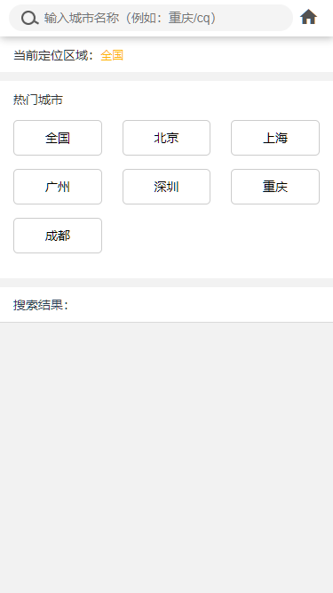

###lavas PWA  
lavas框架是百度前端团队基于vue开发的一套脚手架工具  
开箱即用的Vue-router,Vuex,stylus以及骨架屏，ServiceWorker，ssr支持。让Vue单页应用开发更便捷    

### lavas 增值通 移动端项目知识点  

1,它是一个完整的电商移动端前端项目。简单却涵盖了电商项目必备的一些功能  
2，完整的用户登录注册流程，商品购买流程，收藏商品删除商品功能。  
3，学习Vue-router插件和vuex插件。  
4，学习Axios 进行ajax数据交互。  
5，学习Css预处理器。移动端响应式布局  
6，Vue组件之间参数传递。

### 项目情况  

1，项目包含20个页面左右，部分为动态页面，根据参数获取不同的数据。5个一级页面，多级子页面    
2，项目包含29个真实接口。  
3，开发周期大概需要花费20天左右。  
4，使用lavas PWA框架。
使用stylus 预处理器，Axios发送请求，Localstorage存储登录信息。  
### 技术要求  

1，熟悉HTML+CSS。有一定的jvascript基础。  
2，阅读过Vue框架文档，想真正上手的人  

###其他  
适宜人群：vue初学者。  
根据学习情况，提供部分真实接口进行联调。

     

  

  

  

  

  

  

